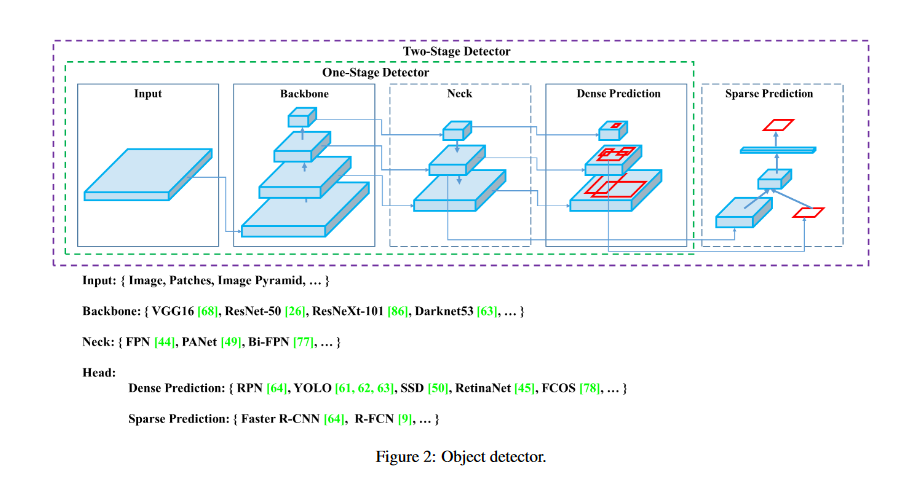
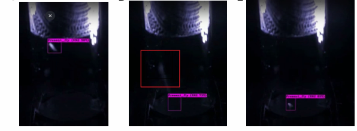

I led a **team of six developers** to implement **customized YOLO for small object tracking** and **ActionFormer for temporal action localization**, achieving an **mAP of 65.6**. The project involved:

Designing a robust data annotation pipeline to ensure fairness and accuracy.

Tailoring YOLO’s internals for small object detection in challenging datasets.

Processing and analyzing 100+ hours of video data (24fps) to detect motion anomalies.

Our model successfully identified falls in Drosophila, revealing critical correlations between increased fall frequency and mortality. This work lays the foundation for unbiased, automated behavioral analysis in biomedical research, enabling further studies on aging and neurodegenerative disease interventions.
    

        
        
    

